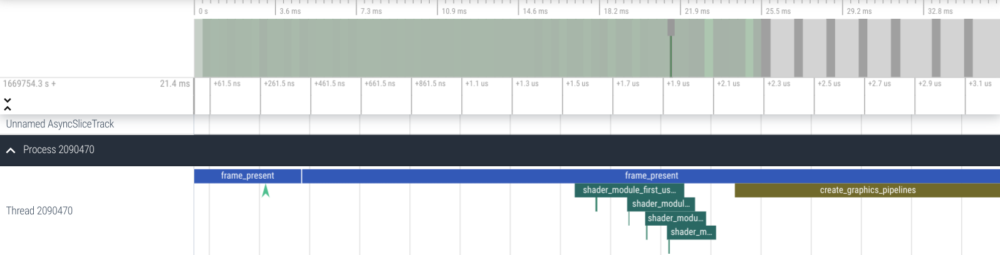
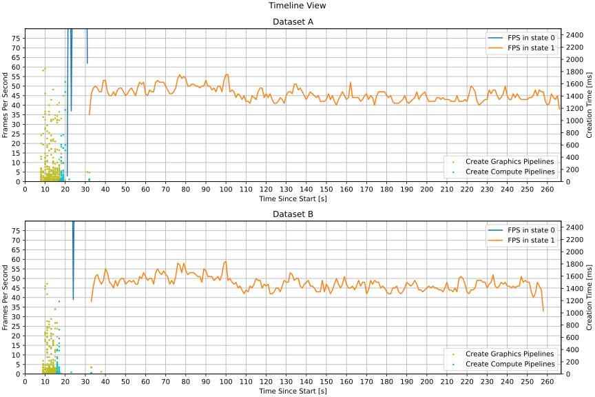

# Vulkan Performance Layers

This project contains 5 Vulkan layers:
1. Compile time layer for measuring pipeline compilation times. The output log file location can be set with the `VK_COMPILE_TIME_LOG` environment variable.
2. Runtime layer for measuring pipeline execution times. The output log file location can be set with the `VK_RUNTIME_LOG` environment variable.
3. Frame time layer for measuring time between calls to vkQueuePresentKHR, in nanoseconds. This layer can also terminate the parent Vulkan application after a given number of frames, controlled by the `VK_FRAME_TIME_EXIT_AFTER_FRAME` environment variable. The output log file location can be set with the `VK_FRAME_TIME_LOG` environment variable. Benchmark start detection is controlled by the `VK_FRAME_TIME_BENCHMARK_WATCH_FILE` (which file to incrementally scan) and `VK_FRAME_TIME_BENCHMARK_START_STRING` (string that denotes benchmark start) environment variables.
4. Pipeline cache sideloading layer for supplying pipeline caches to applications that either do not use pipeline caches, or do not initialize them with the intended initial data. The pipeline cache file to load can be specified by setting the `VK_PIPELINE_CACHE_SIDELOAD_FILE` environment variable. The layer creates an implicit pipeline cache object for each device, initialized with the specified file contents, which then gets merged into application pipeline caches (if any), and makes sure that a valid pipeline cache handle is passed to every pipeline creation. This layer does not produce `.csv` log files.
5. Device memory usage layer. This layer tracks memory explicitly allocated by the application (VkAllocateMemory), usually for images and buffers. For each frame, current allocation and maximum allocation is written to the log file. The output log file location can be set with the `VK_MEMORY_USAGE_LOG` environment variable.

The results are saved in the CSV format to the specified files.

### Log formats
We support the following log formats:

#### CSV format
Each layer (except the cache sideload layer) has a dedicated CSV file into which writes the logs. The files start with the CSV header on top followed by the data entries written in the subsequent lines. In the [Analysis Scripts](#analysis-scripts) section, we will explain how a CSV can be used.

#### The `CommonFile` format
A custom format to have all the logs generated by the layers in a single file. A sample format can be seen in [events.log](./sample_output/events.log). Other than the logs going to the CSV files, there are other logs in the common file indicating the initialization of a layer, shader creation, etc. All the logs contain timestamps making them suitable for a timeline-based plot. A sample plot is depicted in the [Analysis Scripts](#analysis-scripts) section.

To specify the output destination, set `VK_PERFORMANCE_LAYERS_EVENT_LOG_FILE` environment variable. For example:
```
export VK_PERFORMANCE_LAYERS_EVENT_LOG_FILE=events.log
```

#### Chrome Trace Event format
This format enables us to integrate with tools such as [chrome://tracing](chrome://tracing) and [Perfetto](https://ui.perfetto.dev/) for a better visualization. Here is an example of this format:
```
{ "name": "Complete Event", "cat": "pipeline", "ph": "X", "ts": 12345, "pid": 123, "tid": 456, "dur": 123,  "args": {...} }
```
To see more examples, check out [trace_event.log](./sample_output/trace_event.log).

All the events that go the `CommonFile` will also go to the `TraceEvent` file but with a different format. The events are JSON objects grouped in a JSON array.

To specify the output destination, set `VK_PERFORMANCE_LAYERS_TRACE_EVENT_LOG_FILE` environment variable. For example:
```
export VK_PERFORMANCE_LAYERS_TRACE_EVENT_LOG_FILE=trace.log
```

The file can then be imported into [chrome://tracing](chrome://tracing) and [Perfetto](https://ui.perfetto.dev/).
Here is a sample output rendered by Perfetto:
    
For more information about the Chrome Trace Event format see: https://docs.google.com/document/d/1CvAClvFfyA5R-PhYUmn5OOQtYMH4h6I0nSsKchNAySU/preview.

The layers are considered experimental.
We welcome contributions and suggestions for improvements; see [docs/contributing.md](docs/contributing.md).

## Analysis Scripts

The project comes with a set of simple log analysis scripts:
1. [analyze_frametimes.py](scripts/analyze_frametimes.py) -- processes frame time layer logs. Prints summarized results, outputs frames per second (FPS) as CSV files, and plots frame time distributions.
2. [plot_timeline.py](scripts/plot_timeline.py) -- processes event log files. Plots frames per second (FPS) and pipeline creation times. Sample output:
    

You can find more details in the descriptions included in each script file.

## Build Instructions
Sample build instructions:

```shell
# Checkout the submodules.
git submodule update --init

# Build and install performance layers.
mkdir -p <BUILD_DIR> ; cd <BUILD_DIR>
cmake .. \
      -GNinja \
      -DCMAKE_C_COMPILER=<COMPILER> \
      -DCMAKE_CXX_COMPILER=<COMPILER> \
      -DCMAKE_BUILD_TYPE=<CONFIGURATION> \
      -DCMAKE_INSTALL_PREFIX=run \
      -DVULKAN_HEADERS_INSTALL_DIR=<PATH_TO_VULKAN_HEADERS_INSTALL> \
      -DVULKAN_LOADER_GENERATED_DIR=<PATH_TO_VULKAN_LOADER>/loader/generated \
    && ninja \
    && ninja install
```

`CMAKE_BUILD_TYPE` options are: `Release`, `Debug`, `RelWithDebInfo`, `MinSizeRel`.

See [docker/build.Dockerfile](docker/build.Dockerfile) for detailed Ubuntu build instructions.

### Setting `DVULKAN_HEADERS_INSTALL_DIR` and `VULKAN_LOADER_GENERATED_DIR`
`VULKAN_HEADERS_INSTALL_DIR` and `VULKAN_LOADER_GENERATED_DIR` must be absolute paths.

#### If you have the Vulkan SDK
If you have the Vulkan SDK installed in `$VULKAN_SDK`, you can simply use
```
VULKAN_HEADERS_INSTALL_DIR=${VULKAN_SDK}
VULKAN_LOADER_GENERATED_DIR=${VULKAN_SDK}/include/vulkan
```

#### If you built Vulkan-Headers and Vulkan-Loader from source
`VULKAN_HEADERS_INSTALL_DIR` must be set to the installation directory of Vulkan-Headers. For example, if your build directory is `VULKAN_HEADERS_BUILD` and your build commands were:

   ```shell
   cmake <PATH_TO_VULKAN_HEADERS> -GNinja -DCMAKE_INSTALL_PREFIX=run
   ninja
   ninja install
   ```

   you should set `VULKAN_HEADERS_INSTALL_DIR` to `VULKAN_HEADERS_BUILD/run`.

`VULKAN_LOADER_GENERATED_DIR` should be the directory that contains `vk_layer_dispatch_table.h`. For example, if you cloned Vulkan-Loader to `PATH_TO_VULKAN_LOADER`, you should set `VULKAN_LOADER_GENERATED_DIR` to `PATH_TO_VULKAN_LOADER/loader/generated`.

## Enabling the layers:
For operating systems other than Linux, see: https://vulkan.lunarg.com/doc/view/1.3.211.0/linux/layer_configuration.html or the documentation from your Vulkan SDK vendor.
 
### Linux:
There are many ways to enable Vulkan layers, and we present one way that works on Linux. For a more comprehensive Vulkan layer configuration tutorial, see https://vulkan.lunarg.com/doc/view/1.3.211.0/linux/layer_configuration.html.

`$LD_LIBRARY_PATH`: Need to append the directory containing the .so files of performance layers to the `$LD_LIBRARY_PATH`.
```
export LD_LIBRARY_PATH=<path-with-layers.so>:$LD_LIBRARY_PATH
```
`$VK_INSTANCE_LAYERS`: Specify which of the following layers to enable.
1. VK_LAYER_STADIA_pipeline_compile_time
1. VK_LAYER_STADIA_pipeline_runtime
1. VK_LAYER_STADIA_pipeline_cache_sideload
1. VK_LAYER_STADIA_memory_usage
1. VK_LAYER_STADIA_frame_time

To enable multiple layers, separate them with colons. The following command enables both compile time and runtime layers.
```
export VK_INSTANCE_LAYERS=VK_LAYER_STADIA_pipeline_compile_time:VK_LAYER_STADIA_pipeline_runtime
```

`VK_LAYER_PATH`: Path to the directory containing the json files with the name of the layers.
```
export VK_LAYER_PATH=<path-with-layer-json>
```

### Path to the log files:

Each layer writes its results in a specific log file. You can determine the path to the log file for each layer by setting its corresponding environment variable.

```
export VK_COMPILE_TIME_LOG=<log-file-path>
```

To check if the layers are enabled, you can run a sample Vulkan application (such as `vkcube`) and look for the generated layer log files, or check the [Vulkan loader logs](https://github.com/KhronosGroup/Vulkan-Loader/blob/master/docs/LoaderInterfaceArchitecture.md#table-of-debug-environment-variables).

## Disclaimer

This is not an officially supported Google product. Support and/or new releases may be limited.
